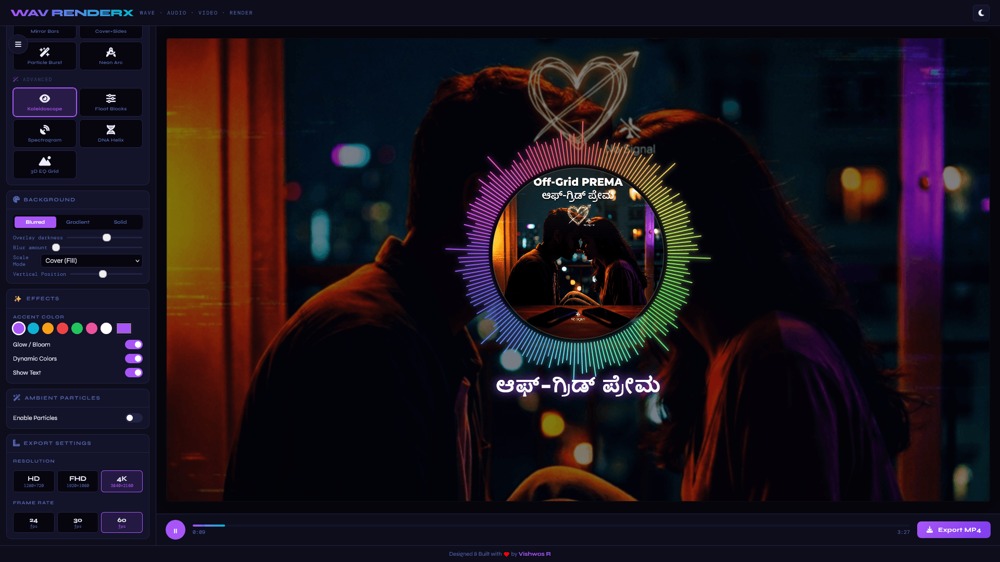

# WAV RenderX
### Wave · Audio · Video · Render
WAV RenderX is a high-performance, studio-quality audio visualizer designed to turn your music into stunning videos. Whether you're a content creator, musician, or just love seeing your sound come to life, WAV RenderX provides a sleek, professional interface to craft your perfect audio-visual experience.

---

## ✨ Key Features

*   **Premium Visualizer Styles**: Choose from a variety of styles, including:
    *   **Essential**: Radial Bars, Morphing Blobs, Mirror Bars, Side Bars, and Particle Emitters.
    *   **Advanced**: Kaleidoscope, Floating Blocks, DNA Helix, 3D Grids, and real-time Spectrograms.
*   **Complete Customization**:
    *   **Typography**: Personalize your track with custom titles, artist names, and curated fonts.
    *   **Branding**: Adjust font sizes, weights, and positioning to match your style.
    *   **Color Themes**: Switch between a sleek Dark Mode and a clean Light Mode.
*   **Dynamic Backgrounds**:
    *   **Blurred Artwork**: Use your album cover as a blurred, atmospheric background.
    *   **Interactive Positioning**: Drag the background directly on the preview to find the perfect framing.
    *   **Gradients & Solid Colors**: Create minimal looks with custom color palettes.
*   **Ambient Atmosphere**: Add a layer of floating particles (Circles, Stars, or Hearts) with customizable movement and colors.
*   **Professional Export**:
    *   Export your creations directly to **high-quality MP4 video**.
    *   Supports resolutions up to **4K** and smooth **60 FPS** rendering.
    *   Works in the background, allowing you to stay productive while your video renders.

---

## 🚀 How to Use

1.  **Upload Your Audio**: Drag and drop your `.mp3` or `.wav` file into the "Upload Audio" section.
2.  **Add Artwork**: Upload your album cover or any image to use as the visualizer's centerpiece and background.
3.  **Customize**:
    *   Enter your **Title** and **Artist** name.
    *   Pick a **Visualizer Style** that fits the mood of your track.
    *   Tweak the colors, glow effects, and background positioning until it's just right.
4.  **Preview**: Use the floating menu button to hide the settings and see your visualizer in full-screen glory.
5.  **Export**: Hit the "Export MP4" button, choose your resolution, and wait for your studio-quality video to download!

---

## 🎨 Designed for Creators

WAV RenderX was built with a focus on **Aesthetics and Performance**. 
*   **Privacy First**: All processing happens locally in your browser. Your audio and images are never uploaded to a server.
*   **Responsive**: Works beautifully on your phone, tablet, or desktop.

---

### Credits
Designed & Built with ❤️ by [Vishwas R](https://vishwas.me/)
